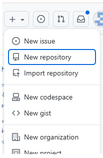
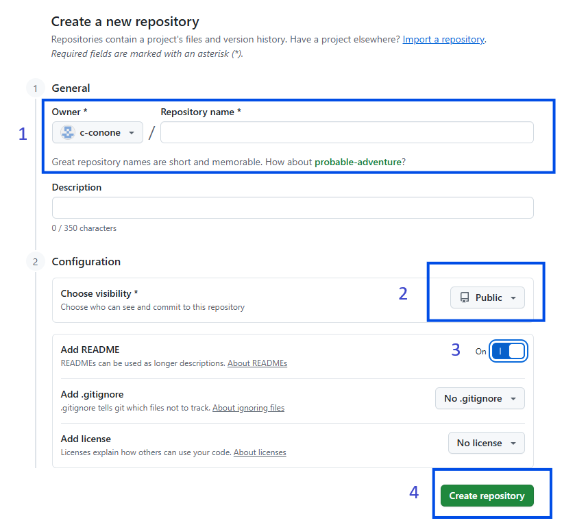
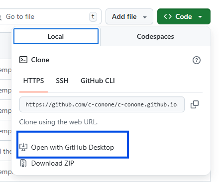
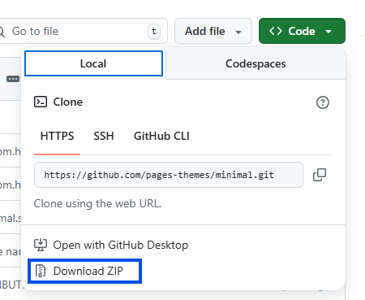
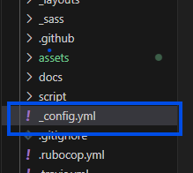
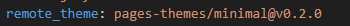
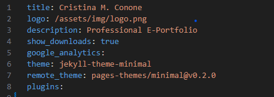
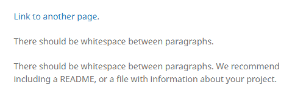
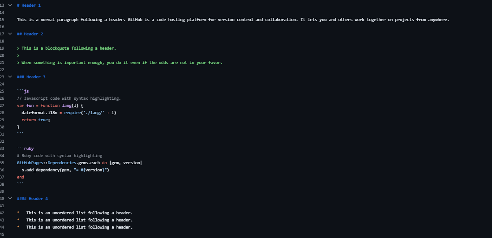
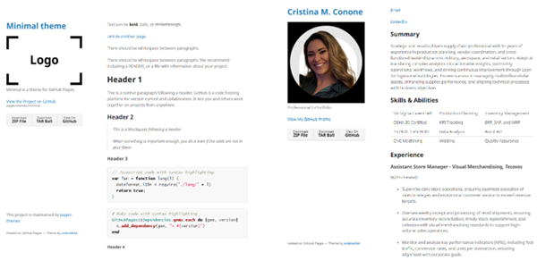

# Introduction

This e-portfolio was developed as part of the graduate-level course OM 620: *Tools and Technologies for Business Analytics* at California State University San Marcos. It showcases a range of coursework and applied projects that demonstrate proficiency in key analytics platforms and methodologies. 

Designed as both a professional showcase and a learning archive, this collection highlights the ability to transform complex data into clear, actionable insights. It invites peers, instructors, and industry professionals to explore the work and engage with the analytical journey it represents.

In addition to showcasing completed work, this document also provides a step-by-step tutorial detailing how the e-portfolio was created. It includes instructions on repository setup, file organization, Markdown formatting, and version control practices using GitHub. The goal is to offer a transparent, replicable process for building a professional online portfolio.

# Creating a Personal E-Portfolio on GitHub Pages

### Create a New GitHub Repository

1. Go to [GitHub](https://github.com/) and log in. 

2. Create a new GitHub repository: 

    - Navigate to the top right corner and click on the **+** icon and select *New repository* from the drop-down menu.

    - Add the owner (GitHub username) and the repository name as <user>.github.io

    - Add a description for the repository. 

3. Configure New Repository Settings:

    - Set visibility option to *Public*.
    
    - Toggle the *Add a README file* button to on.

    - Click *Create repository*.

 
### Clone the Repository to Desktop to Make Changes Locally

1. From the GitHub browser, navigate to the recently created repository.

2. Click the green **Code** button, then select *Open with GitHub Desktop*.

3. GitHub Desktop will launch and prompt you to choose a local path where the repository will be cloned.

4. Click *Clone* to download the repository to your local machine.

*Note: This process can be duplicated for creating working copies / versions for tracking changes, experimenting safely, and reverting to earlier versions without risking corruption of original files.*

### Adding the Minimal Theme Template

1.	Go to [GitHub Pages](https://github.com/pages-themes/minimal) to download the Minimal Theme repository. You can also preview the default Minimal theme [Here.](https://pages-themes.github.io/minimal/)

2.	Click on the **<> Code** button located in the upper right corner and select *Download zip*.

3.	Once downloaded, unzip the files and  place them into the locally cloned repository.

4.	Go to GitHub desktop and push a commit to reflect changes to GitHub site. 

5.	Confirm changes have been incorporated on the static website. 

### Customize Site Using the Minimal Template

1. Open [Visual Studio Code](https://code.visualstudio.com/) for local editing.

2. Select *File* > *Open Folder...* and slect the folder where the repository is located. 

3. From the Explorer pane, open the `READ.md` file to view the "Usage" and "Customizing" for the mininmal theme.

4. Set up theme “Usage”  

    * Locate `_config.yml` and add `pages-themes/minimal@v0.2.0` to the `remote_theme` section.

 

5. Set up the theme “Configuration”

    * Change the title to your preferred professional name (i.e. Cristina M. Conone) and the description to *Professional E-Portfolio*.

 

6. Add your professional headshot:

    * Add your photo to the `img` subfolder of the `assets` folder of the repository and save the image as "logo.png" to maintain the  default template naming convention. 
    
    *Note: logo image can be changed via the "logo" subsection within `_congig.yml` ; if changing image name outside of the template default, ensure image name and path are correctly anntated.*

       

7. Add professional links:

     * Add a link that when selected will opens the user's email app with a new message addressed to whatever email is specified by adding `[Email](mailto:<your email>) ` to `index.md` below the *layout* section. THis can also be accomplished by editing the default *Link to another page*. For further email customization click [Here.](https://blog.markdowntools.com/posts/markdown-email-links-using-mailto)

    * Add a clickable link to navigate to your LinkedIn profile by adding `[LinkedIn](https://www.linkedin.com/in/your-user-name)` in the same section of `index.md`. 

    *Note: this format can be followed for adding any other links desired.*

      

8. Add sections in `index.md` following standard resume format:
    
    * Edit default headers and subsections to add professional summary, skills, work experience, and education. The template default provides `markdown` syntax that can be utilized. 

        

### Save Changes and Push a Commit to GitHub

1. Save all changes made in VScode.

2. Go to GitHub desktop and push a final commit.

3. Navigate to github.io website to verify all changes have been properly updated.

#### Final Result 

   